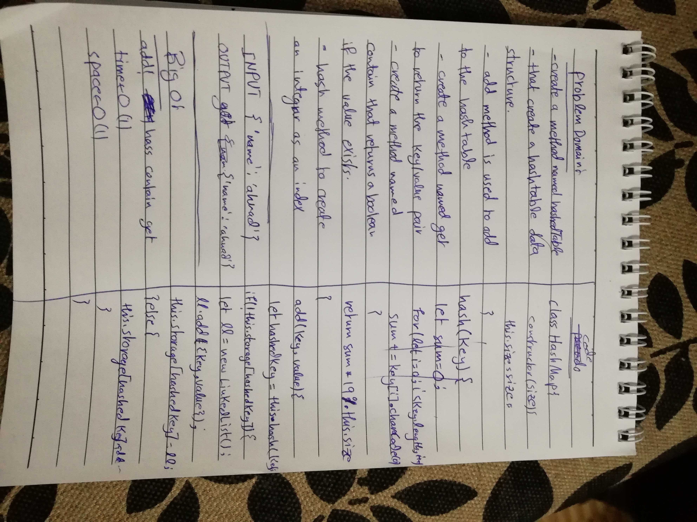

# Challenge 30

# Hash Table 

# Challenge Summary
Hash Tables is the challenge for this time!!, the challenge is for working with hash tables, be creating a hash method to create an integer, that acts as index for the key value pairs held inside the hashed table. also create an add() method, get() method, and contains() method.

## Challenge Description
create a method that creates a hashed map, it should have a hashing method, and add method to add to the hashed map, a method to get values, and a method to check if a key/value pair exists in the hashed map.

## Approach & Efficiency

### Big O
 #### hash()
  time O (n)
  space O (n)
   Big O is O(n), in Both cases because of the for loop, and the need to loop through the split string. to finish the hashing algorithm.
 #### add()
  time O(1)
  space O(1)
   Because it is a straight forward add method, no loops are needed, and no outside variables are needed.
 #### get()
  time O(n)
  space O(1)
   Because in the worst case scenario, the whole values are located on the same bucket and the key we are searching for is located at the end of the linked list, so a Big O(n). And the space is O(1), because we are returning the wanted value. 
 #### contain()
  time O(n)
  space O(1)
   Because in the worst case scenario, the whole values are located on the same bucket and the key we are searching for is located at the end of the linked list, so a Big O(n). And the space is O(1), because we are returning a boolean.

### Acknowledgments
- [Mr-Ahmad-Alawad](https://github.com/Ahmad-Alawad)
- [Qusai-Al-Hanaktah](https://github.com/Qusai-alhanaktah)

### worked as a pair
- Qusai A. Al-Hanaktah
- Ahmad K. Al-Mahasneh

## Solution
