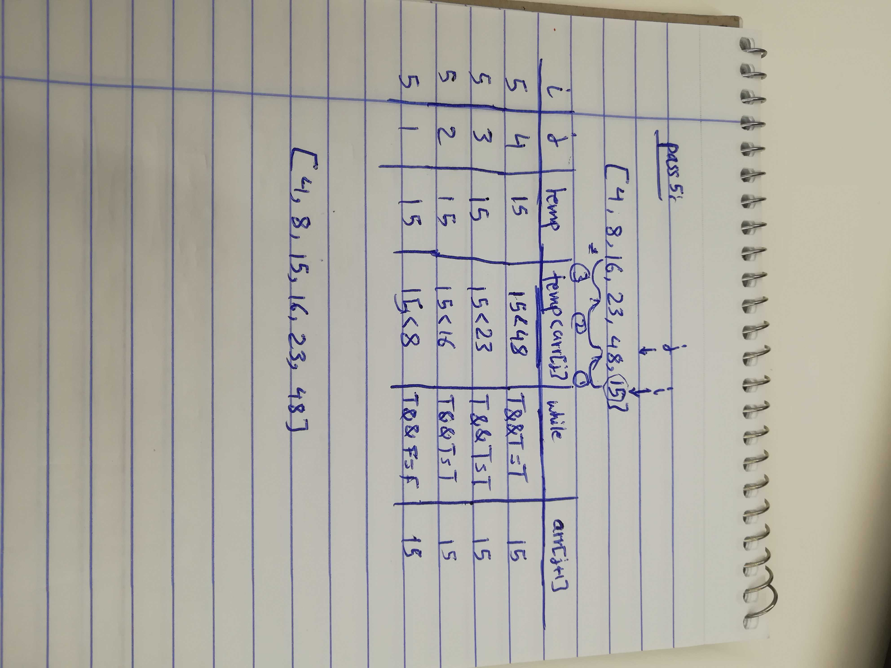

# Challenge 26

# Insertion Sort

# Challenge Summary
This challenge is to enhance the pseudo code reading skill. A pseudo code is given with the expectation to write the code, test the code, and follow the loops.

## Challenge Description
Given a pseudo code for insertion sort method, with a working tested code, and follow the code.

## Approach & Efficiency
nested loops are used, with no built-in methods at all, no other variables are used.

### Big O
time O (n^2)
space O (1)
  Time: because of Nested loops. in the worst case the array will be looped through twice. 
  Space: No variables are defined, the method is changing the array.

## Solution

