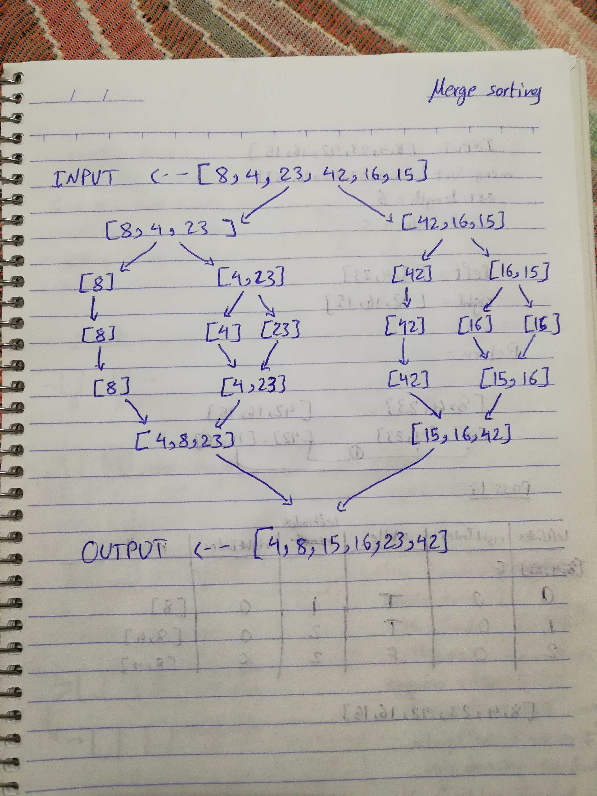

# Challenge 27 

# Merge Sort

# Challenge Summary
This challenge is about the merge sort method, which works by dividing the array in halves, for multiple times. Until we get single values, sort the values and merge them together.

## Challenge Description
Sort an array using the Merge Sort Method.

## Approach & Efficiency
the approach is about dividing the array in halves, so the sorting will be easier for smaller arrays. After that merge the sorted arrays.

### Big O
time O (n)
space O (n^2)
 Time is n because of the looping through the entire array.
 Space is n^2 because of multiple divisions of the array, and assigned index values and middleValue.

## Solution
