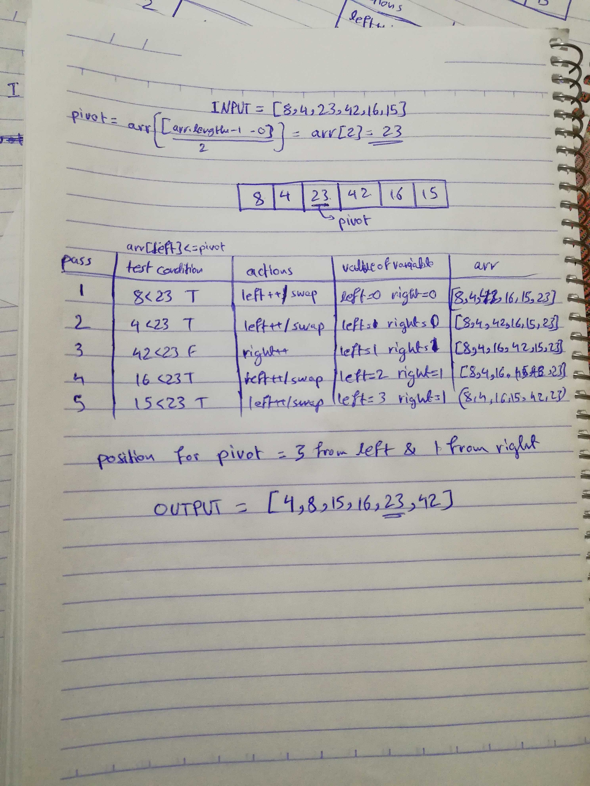

# Challenge 28

# Quick Sort

# Challenge Summary
this challenge is another sorting challenge, this time for the quick sort method. by applying the divide and conquer method, the division happens at a pivot point, the smaller values are to the left, and the larger values to the right.

## Challenge Description
Follow the pseudo code given, translate it to code, and test it. 

## Approach & Efficiency
Divide and conquer approach is used, by dividing the array from a pivot point, where the smaller values are located to the left, and the larger values are located to the right.

### Big O
time O (n^2)
space O (nlogn)
Time: because of having two while loops.
Space: because of having too many variables changing and assigned to do other values.

## Solution
